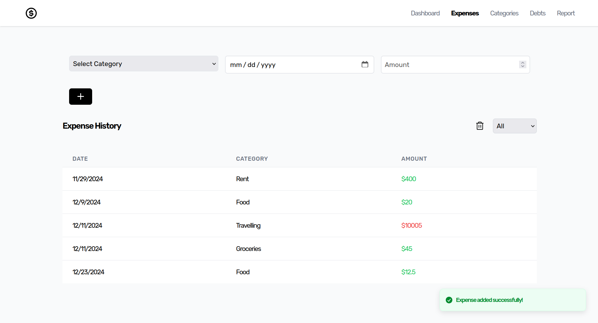

# ExpenseTracker
<div align="center">
<div>

</div>
</div>

<br>

## Getting Started

### Setting Up & Running Locally

1. Clone the repository from GitHub:

   ```sh
   git clone https://github.com/niharPat/Expense-Tracker.git
   ```

2. To Install the necessary dependencies navigate to backend and frontend directories and run:

   ```sh
   npm install
   ```

4. Define your MONGO_URL in /backend/.env:

   ```env
   MONGO_URL= <your mongodb url>
   ```

5. Start the backend and frontend:

   ```sh
   /backend > npm start
   /frontend > npm run dev
   ```

## Running Container Locally

### Start Docker Engine

1. In docker-compose.yml provide the MONGO_URL
```yml
    environment:
      - MONGO_URL=
```

2. Run docker compose
```sh
docker compose up --build
```

### Representation
```sql
            +------------------+
            |    User Browser  |
            |------------------|
            |  Accesses via    |
            |  localhost:3000  |
            +------------------+
                     |
                     v
         +----------------------+
         |      frontend        |
         |----------------------|
         |  Runs on port 3000   |
         |  Built with Node.js  |
         |  Uses Vite for dev   |
         +----------------------+
                     |
          depends_on backend
                     v
         +----------------------+
         |      backend         |
         |----------------------|
         |  Runs on port 8000   |
         |  Built with Node.js  |
         |  Exposes API         |
         |  Uses CORS for       |
         |  cross-origin access |
         +----------------------+
                     |
                     v
         +----------------------+
         |       MongoDB        |
         |----------------------|
         | (Environment defined)|
         | Backend connects via |
         |  MONGO_URL           |
         +----------------------+

```
### Notes
- **`frontend`** depends on the `backend` service to be available.
- Both containers are part of the `app-network` bridge network for communication.
- Ports `3000` and `8000` are exposed on the host for development.
- **`volumes`** are used for live updates during development:
  - `./backend:/app` syncs backend code.
  - `./frontend:/app` syncs frontend code.
